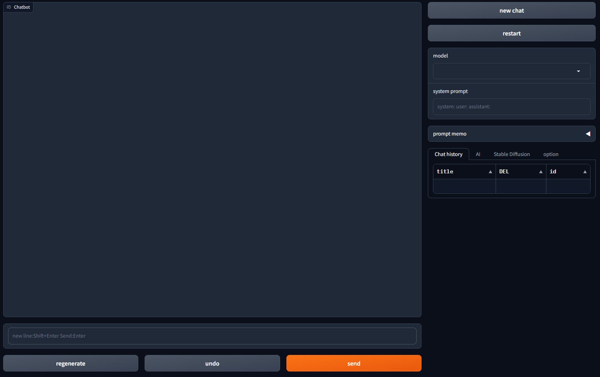

# ChatSwitch

## Installation

### Windows

To install the required libraries on Windows, simply run the following batch file:

```bash
install.bat
```

### Linux/Mac

For Linux and Mac users, you can install the necessary libraries by executing the following shell script:

```bash
./install.sh
```

## Starting the Web UI

### Windows

You can start the Web UI on Windows by running the following batch file:

```bash
webui.bat
```

### Linux/Mac

For Linux and Mac users, you can start the Web UI by executing the following shell script:

```bash
./webui.sh
```

## Usage
### Overview

This project allows you to switch between multiple LLMs and chat with them. All settings and conversations are stored locally in a file named `memory.pkl`.


### Features

- **Switching LLMs**: You can easily switch between different Language Models.
- **Local Conversations**: All conversations are saved locally in `memory.pkl`, allowing you to resume previous chats.

### How to Use

1. **Start the Web UI**: Run `webui.bat` (Windows) or `./webui.sh` (Linux/Mac) to launch the Web UI.
2. **Choose an LLM**: Select the Language Model you want to chat with.
3. **Chat**: Start chatting! Your conversations will be saved in `memory.pkl`.

### Important Notes

- Please do not manually edit the `memory.pkl` file, as it may cause unexpected behavior.
- Make sure to have the necessary permissions to read and write to the file location.

Feel free to explore and enjoy chatting with various Language Models!

## License

This project is licensed under the MIT License. You are free to use, modify, distribute, and sell it under the terms of the license. For more details, see the [LICENSE](LICENSE) file in the project repository.

## Acknowledgments

This project uses [Gradio](https://gradio.app/), an open-source library for creating user interfaces. Please refer to Gradio's [license](https://github.com/gradio-app/gradio/blob/master/LICENSE) for terms and conditions.
