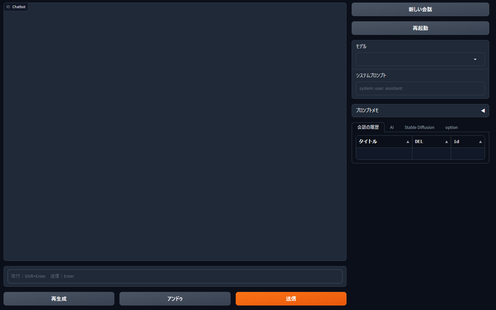
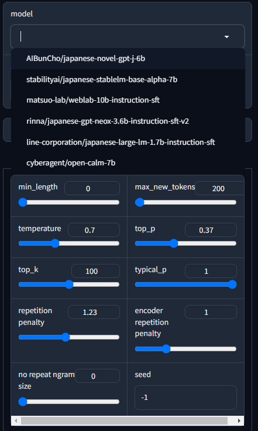

# ChatSwitch

## インストール

このリポジトリをDownload ZIPでダウンロードするか、gitでcloneしてください。

Windowsの場合は install.bat を、Linux/Macの場合は install.sh を実行してください。

## WebUIの起動

Windowsの場合は webui.bat を、Linux/Macの場合は webui.sh を実行してください。

コンソールにURLが表示されるので、そのURLをブラウザで開いてください。

## 使用方法

モデルを選択し、画面下部のプロンプト入力欄にプロンプトを入力してください。

プロンプトはEnterキーまたは送信ボタンで送れます。

入力された内容はコンピューターのローカルにのみ送られ、外部には一切送られません。

入力内容や設定は、実行フォルダのmemory.pklに保存されます。

モデルを初めて選択したときや、モデルに更新があった際は、自動でダウンロードが行われ、modelsフォルダに保存されます。


## 対応モデル

    "stabilityai/japanese-stablelm-base-alpha-7b",
    "matsuo-lab/weblab-10b-instruction-sft",
    "rinna/japanese-gpt-neox-3.6b-instruction-sft-v2",
    "rinna/japanese-gpt-neox-3.6b-instruction-ppo",
    "line-corporation/japanese-large-lm-1.7b-instruction-sft",
    "cyberagent/open-calm-7b",
    "AIBunCho/japanese-novel-gpt-j-6b",
    "NovelAI/genji-jp",
    "TheBloke/Llama-2-7B-GPTQ",
    "TheBloke/Llama-2-13B-chat-GPTQ",
    "TheBloke/Llama-2-70B-GPTQ",
    "TheBloke/CodeLlama-7B-Instruct-GPTQ",

## ライセンス

このプロジェクトは MIT ライセンスに基づいてライセンスされています。 ライセンス条項に基づいて、自由に使用、変更、配布、販売することができます。 詳細については、プロジェクト リポジトリの [LICENSE](LICENSE) ファイルを参照してください。

## 謝辞とクレジット

このプロジェクトは、多くのLLMに大いにインスパイアされました。このような先駆的な研究と公開モデルなしでは、本プロジェクトは成立しえませんでした。

このプロジェクトでは、ユーザー インターフェイスを作成するためのオープンソース ライブラリである [Gradio](https://gradio.app/) を使用します。 利用規約については、Gradio の [ライセンス](https://github.com/gradio-app/gradio/blob/master/LICENSE) を参照してください。

このプロジェクトは、[oababooga/text-generation-webui](https://github.com/oababooga/text-generation-webui/) から深くインスピレーションを受けました。 このコンセプトは私の作業に大きな影響を与えただけでなく、そのコードの一部を適応させました。 リポジトリで提供される革新的なアイデアと実装の詳細に非常に深く感謝をしています。

## Installation

### Windows

To install the required libraries on Windows, simply run the following batch file:

```bash
install.bat
```

### Linux/Mac

For Linux and Mac users, you can install the necessary libraries by executing the following shell script:

```bash
./install.sh
```

## Starting the Web UI

### Windows

You can start the Web UI on Windows by running the following batch file:

```bash
webui.bat
```

### Linux/Mac

For Linux and Mac users, you can start the Web UI by executing the following shell script:

```bash
./webui.sh
```

## Usage
### Overview

This project allows you to switch between multiple LLMs and chat with them. All settings and conversations are stored locally in a file named `memory.pkl`.

<details><summary>LLMs</summary>


</details>
<details><summary>Stable Diffusion</summary>


</details>
<details><summary>option</summary>


</details>

### Features

- **Switching LLMs**: You can easily switch between different Language Models.
- **Local Conversations**: All conversations are saved locally in `memory.pkl`, allowing you to resume previous chats.
 
### How to Use

1. **Start the Web UI**: Run `webui.bat` (Windows) or `./webui.sh` (Linux/Mac) to launch the Web UI.
2. **Choose an LLM**: Select the Language Model you want to chat with.
3. **Chat**: Start chatting! Your conversations will be saved in `memory.pkl`.

### Important Notes

- Please do not manually edit the `memory.pkl` file, as it may cause unexpected behavior.
- Make sure to have the necessary permissions to read and write to the file location.

Feel free to explore and enjoy chatting with various Language Models!

## License

This project is licensed under the MIT License. You are free to use, modify, distribute, and sell it under the terms of the license. For more details, see the [LICENSE](LICENSE) file in the project repository.

## Acknowledgments and Credits

This project was heavily inspired by many LLMs. Without such pioneering research and public models, this project would not have been possible.

This project uses [Gradio](https://gradio.app/), an open-source library for creating user interfaces. Please refer to Gradio's [license](https://github.com/gradio-app/gradio/blob/master/LICENSE) for terms and conditions.

This project was deeply inspired by [oobabooga/text-generation-webui](https://github.com/oobabooga/text-generation-webui/). Not only has the concept been a major influence on our work, but we have also adapted some of its code. We are immensely grateful for the innovative ideas and implementation details provided in their repository.
